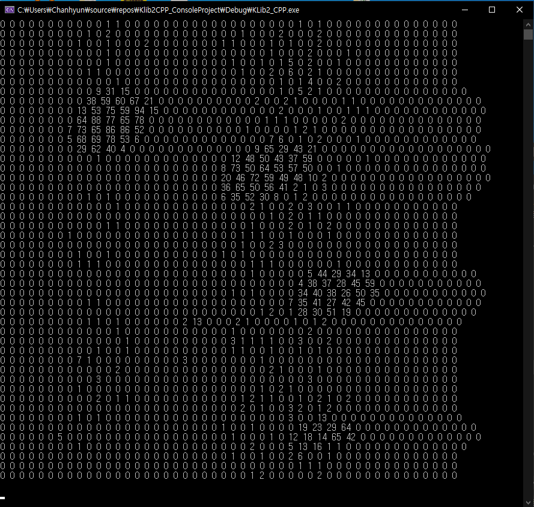

# klib2-cpp  [OpenFrameWorks]
Max FPS(Frames per second) : 15

DEVELOPMENT ENVIRONMENT
-----------------------
* Visual Studio 2017
* OpenFrameworks 0.1.0 (included in this repository): OpenFrameworks folder should be at `c:\of_v10.0_vs_release\`
  * Download: http://openframeworks.cc/download
* Snowforce 3
   * https://www.kitronyx.com/downloads.html
   * http://sites.kitronyx.com/wiki/applications/snowforce-3
   
QUICK START
-----------
* Download or clone source code
* Open ./of_v0.10.0_vs2017_release/apps/KLib2/KLib2/KLib2.sln
   * /KLib2_Cpp/src/ofApp.cpp : Main event routine OpenFrameworks
   * /KLib2_Cpp/KLib2Cpp.h : KLib2 header file
   * /KLib2_Cpp/KLib2Cpp.cpp : KLib2 c++ code file

# klib2-cpp  [Console Project]

DEVELOPMENT ENVIRONMENT
-----------------------
* Visual Studio 2017
* Snowforce 3
   * https://www.kitronyx.com/downloads.html
   * http://sites.kitronyx.com/wiki/applications/snowforce-3
   
QUICK START
-----------
* Download or clone source code
* /Klib2CPP_ConsoleProject\Klib2CPP_Project/KLib2Cpp.h : KLib2 header file
* /Klib2CPP_ConsoleProject\Klib2CPP_Project/KLib2Cpp.cpp : KLib2 c++ code file
* /Klib2CPP_ConsoleProject\Klib2CPP_Project/main.cpp : Sample code file
