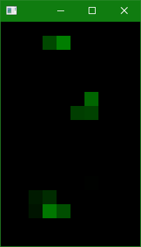

# klib2-cpp

DEVELOPMENT ENVIRONMENT
-----------------------
* Visual Studio 2017
* OpenFrameworks 0.1.0: OpenFrameworks folder should be at `c:\of_v10.0_vs_release\`
  * Download: http://openframeworks.cc/download

QUICK START
-----------
* Download or clone source code
* Open apps/KLib2/KLib2/KLib2.sln
